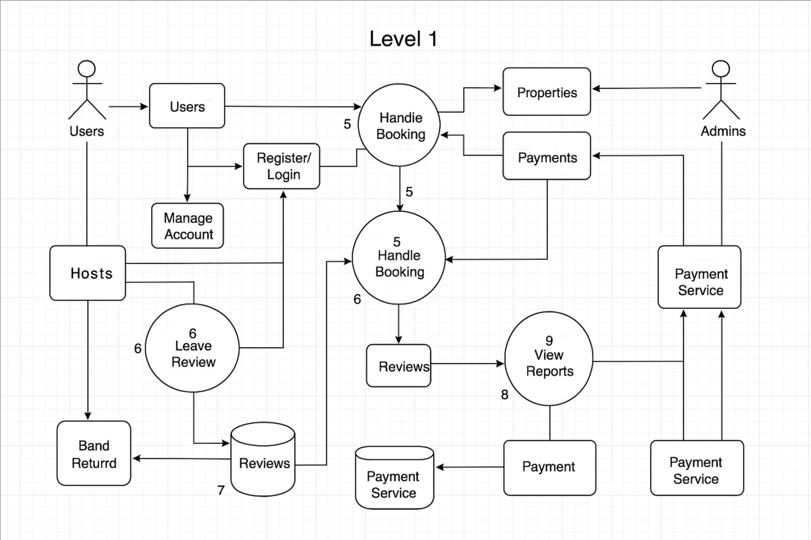

# 🛠️ Airbnb Clone – Data Flow Diagram (DFD)

This document contains a Level 1 Data Flow Diagram (DFD) that illustrates how data moves through the backend system of the Airbnb Clone application.

## 🎯 Objective

To visually represent the major processes, data stores, and data interactions between the system and its external/internal entities.

## 📌 Scope of the DFD

The diagram focuses on the core backend operations, including:

- **User Registration & Login**
- **Property Management** (creation, updates, deletions)
- **Booking Workflow** (from selection to confirmation)
- **Payment Handling**
- **Review Submission**
- **Admin Monitoring and Management**

## 👤 External Entities

- **Guest**: End user who searches and books properties.
- **Host**: User who lists and manages properties.
- **Admin**: Oversees platform usage and disputes.
- **Payment Gateway**: Third-party service (e.g., Stripe, PayPal) for handling financial transactions.

## 🔄 Processes and Data Flows

- Guests register or log in → credentials validated → user profile created or updated
- Guests search for properties → system queries the listings data store
- Guests make bookings → system stores reservation details
- Hosts manage their listings → create/update/delete entries in the property data store
- Payment is initiated → processed via Payment Gateway → transaction stored
- Guests submit reviews → stored and linked to bookings
- Admin interacts with all datasets for moderation

## 🖼️ Diagram

## 🗂️ Files Included

- `data-flow.png`: The visual representation of the data flow in the system.
- `README.md`: This explanatory file.

## 📊 Diagram Summary

This Level 1 DFD helps stakeholders understand:

- How data enters, flows, and is stored in the system
- The key processes that transform user inputs into results
- The interactions between users and external services (e.g., payments)
